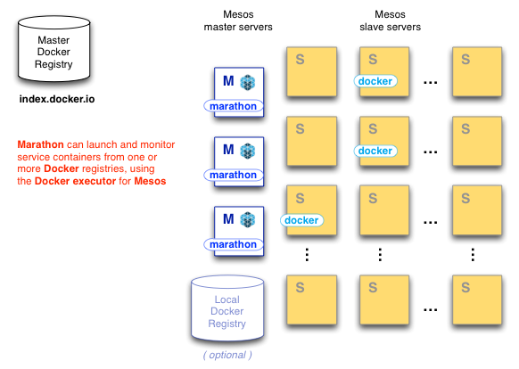
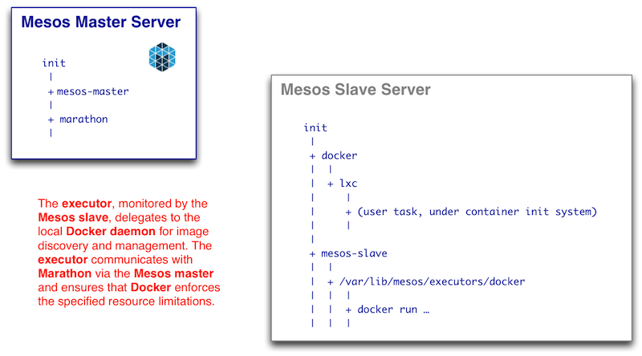

# Mesos / Docker Integration

## Summary

Docker containers provide a consistent, compact and flexible means of packaging application builds. Delivering applications with Docker on Mesos promises a truly elastic, efficient and consistent platform for delivering a range of applications on premises or in the cloud.
This repository combines Docker with the [Mesos](http://mesos.apache.org) cluster scheduler and [Marathon](https://github.com/mesosphere/marathon) but could also be used with other Mesos frameworks such as [Chronos](https://github.com/airbnb/chronos).

## Getting Started

This [tutorial](https://github.com/mesosphere/mesos-docker/blob/master/tutorial.md) shows you how you can get started with Mesos / Docker. 

## Help

If you have questions, please post on the [Marathon Framework Group](https://groups.google.com/forum/?hl=en#!forum/marathon-framework) email list.
You can find Mesos support in the `#mesos` channel on [freenode][freenode] (IRC).
The team at [Mesosphere](http://mesosphere.io) is also happy to answer any questions.

## Authors

* [Jason Dusek](https://github.com/solidsnack)

## Requirements

* [Mesos][Mesos] 0.14+

[Mesos]: http://incubator.apache.org/mesos/ "Apache Mesos"
[freenode]: http://freenode.net/ "IRC channels"

## How Mesos-Docker Integration Works

A Mesos cluster comprises a few masters and many slaves. As work is farmed out
to them, Mesos slaves delegate to _executors_ for the setup and teardown of
individual tasks. It is the executor that manages communication between the
slave and the Docker daemon. The Docker daemon manages caching and launch of
Docker images, which can be pulled from the global Docker index or a local
registry.

When a Docker container is started as a Mesos task, it runs beneath the Docker
daemon on a slave server. Although the Docker container does not run as a true
child process of the executor, as it would have under the old Docker
standalone mode, the executor is able to manage translation of resource
limits, signals and Mesos process control messages to appropriate calls of the
`docker` tool. Fine-grained resource monitoring, forthcoming in mainline Mesos
and part of some service management tools, is hard to do right if the
container does not run directly under the executor -- so this architecture may
be revised in the future.

When a user requests a Docker container with Marathon, using the web UI or the
HTTP API as in the examples above, the request is ultimately delegated to the
LXC tools, by way of Mesos and Docker.

* Marathon makes a resource request from the Mesos master and then waits to
  accept an appropriate offer.

* Once an offer is accepted, the Mesos master sends the task's specification
  to the slave.

* On the slave server, the Mesos slave daemon calls the Mesos-Docker executor
  which in turn calls the `docker` command line tool.

* The `docker` command line tool talks to the local Docker daemon, which
  manages interactions with the cache of images and the LXC tools.

* If the image is cached, it will be run from the cache. Otherwise, the Docker
  daemon contacts a Docker registry to retrieve it.

* The Docker daemon runs the container under the LXC tools.

